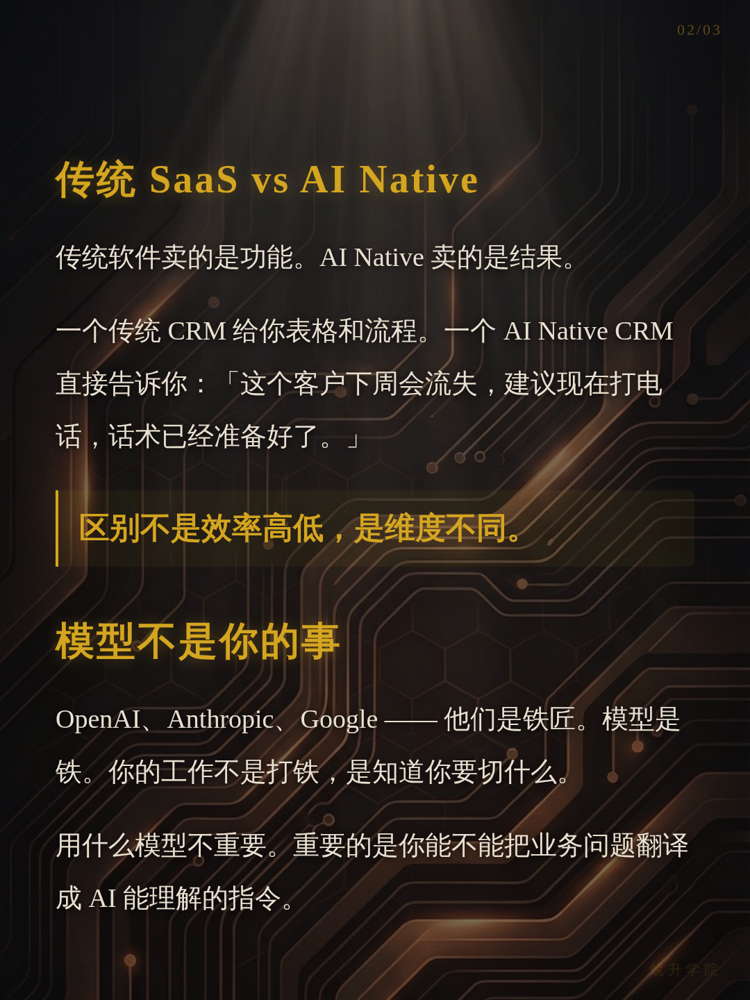
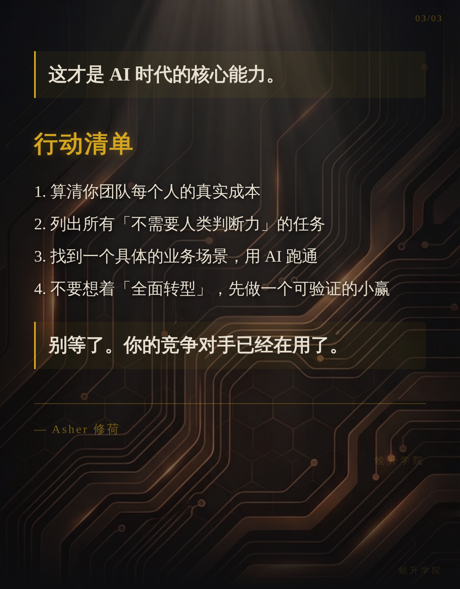
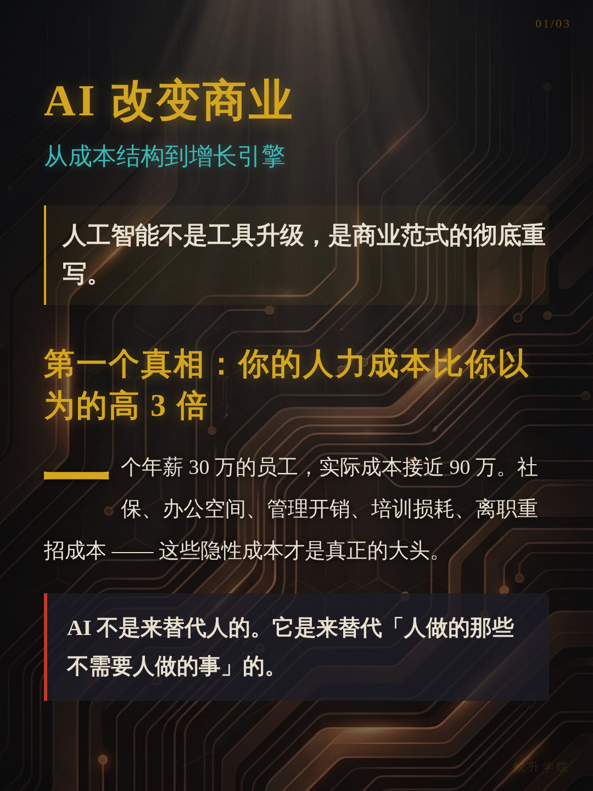

<div align="center">

# Asyre Social

**统一社媒内容创作 — AI 图片生成 + 精排版引擎 + 品牌管理。**


[**English**](README.md)

</div>

---

## 三种模式，一个技能

| 模式 | 引擎 | 适用场景 | 输出 |
|------|------|---------|------|
| **A: AI 直出** | Gemini 图片生成 | 封面、海报、信息图 | AI 生成 PNG |
| **B: 精排版** | HTML/CSS → Playwright → PNG | 长文、深度内容、多页卡片 | 1080×1440 分页 PNG |
| **C: 混合** | A + B 结合 | 系列内容（AI封面 + 文字内容页） | 混合 PNG 系列 |

AI 根据内容自动选择最佳模式 — 也可以用 `--mode=ai`、`--mode=text`、`--mode=hybrid` 手动指定。

---

## AI 风格库（Mode A）

12 种视觉风格，同一主题「AI 改变商业」的不同演绎：

| | |
|---|---|
|  |  |
| **cute** — 甜美可爱少女风 | **fresh** — 清新自然 |
|  |  |
| **warm** — 温暖亲切 | **bold** — 高冲击力 |
|  |  |
| **minimal** — 极简高级 | **retro** — 复古怀旧 |
|  |  |
| **pop** — 活力四射 | **notion** — 极简线条画，知性 |
|  |  |
| **chalkboard** — 粉笔黑板风 | **study-notes** — 手写笔记照片风 |
|  |  |
| **screen-print** — 丝网印刷海报风 | **tuisheng** — 暗色赛博学术风 |

每种风格可与 8 种布局（稀疏、平衡、密集、列表、对比、流程、脑图、象限）自由组合，另有 23+ 场景预设。

### 预设示例

预设 = 风格 + 布局一键组合。同一主题的三种预设效果：

| | |
|---|---|
|  |  |
| **knowledge-card** — notion + dense（知识卡） | **tutorial** — chalkboard + flow（教程） |


*poster — screen-print + sparse（海报）*

---

## 信息图引擎（21 种布局 × 20 种风格）

高密度信息可视化 — 单张结构化信息图。

| | | |
|---|---|---|
|  |  |  |
| **bento-grid** — 多主题概览 | **bridge** — 问题→解决方案 | **circular-flow** — 循环流程 |
|  |  |  |
| **comparison-table** — 对比表格 | **binary-comparison** — A vs B | **comparison-matrix** — 多维矩阵 |
|  |  |  |
| **funnel** — 转化漏斗 | **iceberg** — 冰山模型 | **hierarchical-layers** — 金字塔 |
|  |  |  |
| **hub-spoke** — 中心辐射 | **tree-branching** — 知识树 | **linear-progression** — 时间线 |
|  |  |  |
| **dashboard** — KPI 看板 | **isometric-map** — 等距空间图 | **periodic-table** — 元素周期表 |
|  |  |  |
| **venn-diagram** — 韦恩图 | **jigsaw** — 拼图关联 | **winding-roadmap** — 蜿蜒路线图 |
|  |  |  |
| **comic-strip** — 漫画叙事 | **story-mountain** — 故事张力弧 | **dense-modules** — 高密度模块 |
|  | | |
| **structural-breakdown** — 结构分解 | | |

每种布局可搭配 20 种视觉风格（手工质感、古典学术、黏土动画、赛博霓虹、宜家说明书、折纸、像素艺术等）。

---

## 精排版引擎（Mode B）

像素级精准的文字渲染 — Markdown 经 HTML/CSS + Playwright 输出为 1080×1440 PNG 卡片。没有 AI 文字扭曲，每个字都清晰锐利。

**示例：「AI 改变商业」文章，tuisheng 品牌多卡渲染：**

| | |
|---|---|
|  |  |



*3 页卡片系列，自动色调感知（strategic → 金色）、首字下沉、金句高亮、电路金纹理背景。*

### 6 种渲染模具

| 模具 | 输出 | 适用场景 |
|------|------|---------|
| 多卡 (`-m`) | 每页 1080×1440 | 小红书系列、社媒卡片 |
| 长图 (`-l`) | 1080×自适应高度 | 单张长卡片 |
| 信息图 (`-i`) | 1080×自适应高度 | 数据可视化 |
| 视觉笔记 (`-v`) | 1080×自适应高度 | 手绘风格 |
| 漫画 (`-c`) | 1080×自适应高度 | 黑白漫画 |
| 白板 (`-w`) | 1080×自适应高度 | 结构化框图 |

特性：自动色调感知、金句高亮、首字下沉、溢出保护、品牌 CSS 注入。

---

## 混合模式（Mode C）

AI 生成封面（视觉冲击）+ 精排版内容页（文字清晰）。两种引擎的最佳组合。

| | |
|---|---|
|  |  |
| **第 1 页：AI 封面**（Gemini Pro） | **第 2 页：精排版内容**（Playwright） |

*封面用金色锤子的概念艺术隐喻。内容页使用相同的 tuisheng 品牌色彩，确保 AI 与 HTML 渲染的视觉一致性。*

---

## 品牌系统

每个客户拥有自己的视觉身份 — 覆盖 AI 生图和 HTML 排版两条路径。

### 内置品牌

| 品牌 | 视觉风格 | 适用场景 |
|------|---------|---------|
| **tuisheng** | 暗色 + 金/青，赛博学术 | 社群知识分享 |
| **asher** | 暖纸质感，个人温度 | 个人小红书、朋友圈 |
| **qihe** | 商务蓝，干净专业 | 客户报告、方案交付 |

### 创建你的品牌

首次使用时回答 3 个问题：
1. 目标受众
2. 品牌个性（3个词）
3. 美学方向（暗色/亮色/温暖/极简）

系统自动生成 `brand.json` + `base.css` + `ai-style.md` — 一套完整的视觉系统。

---

## 安装

### Claude Code

```bash
git clone https://github.com/Qihe-agent/asyre-social ~/.claude/skills/asyre-social
```

使用：
```
/asyre-social
```

### OpenClaw

```bash
clawhub install asyre-social
```

### 其他 AI 工具

将 `SKILL.md` 作为 system prompt，引用支持文件即可。

---

## 使用方法

```bash
/asyre-social [主题或内容]                           # 自动检测模式
/asyre-social article.md --mode=text                 # 强制精排版
/asyre-social --mode=ai --preset=knowledge-card      # AI + 预设
/asyre-social --brand=tuisheng                       # 指定品牌
/asyre-social article.md --yes                       # 非交互模式
```

---

## 文件结构

```
asyre-social/
├── SKILL.md                         # 核心工作流（AI 读取这个文件）
├── openclaw.plugin.json             # OpenClaw 插件配置
├── brands/
│   ├── _template/brand-template.json  # 新品牌模板
│   ├── tuisheng/                    # 暗色赛博学术品牌
│   ├── asher/                       # 暖色个人品牌
│   └── qihe/                        # 商务专业品牌
├── references/
│   ├── routing.md                   # 模式路由决策树
│   ├── taste.md                     # 反 AI slop 品味准则
│   ├── ai-gen/                      # AI 生图参考
│   ├── text-render/                 # 精排版参考
│   └── config/                      # 配置参考
├── scripts/                         # 渲染脚本
└── templates/                       # HTML 模板
```

## 致谢

- **[baoyu-xhs-images](https://github.com/JimLiu/baoyu-skills)** by JimLiu — 小红书信息图生成引擎
- **Asyre Design System** — 品牌管理与反 AI slop 质量体系

## License

MIT License. 详见 [LICENSE](LICENSE)。

---

<div align="center">

**别再做千篇一律的内容。做有品牌感的东西。**


Powered by [**Asyre**](https://github.com/Qihe-agent)

</div>
